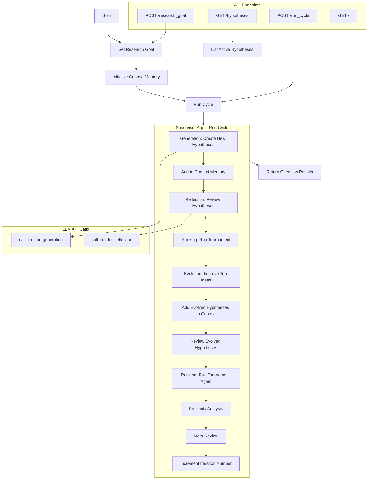

# AI Co-Scientist - Hypothesis Evolution System (v1)

This project implements an AI-powered system for generating, reviewing, ranking, and evolving research hypotheses. It leverages Large Language Models (LLMs) for various tasks, including hypothesis generation, reflection, and comparison. The system is designed to assist researchers in exploring a research space and identifying promising hypotheses.

https://storage.googleapis.com/coscientist_paper/ai_coscientist.pdf

## Overview

This project implements a multi-agent system within the `app` package that iteratively generates and refines research hypotheses. The code is organized into modules:
*   `app/models.py`: Defines data structures (`Hypothesis`, `ResearchGoal`, `ContextMemory`) and API request/response schemas.
*   `app/utils.py`: Contains utility functions for LLM calls, logging, similarity scoring, etc.
*   `app/agents.py`: Implements the core agent logic (`GenerationAgent`, `ReflectionAgent`, `RankingAgent`, `EvolutionAgent`, `ProximityAgent`, `MetaReviewAgent`, `SupervisorAgent`).
*   `app/api.py`: Defines the FastAPI application, API endpoints, startup events (like fetching models), and serves the HTML frontend.
*   `app/config.py`: Handles loading the `config.yaml` file.
*   `app/main.py`: The main entry point for running the Uvicorn server.

**Core Components:**

*   **LLM Integration:** Uses the OpenRouter API to interact with LLMs. The default model is specified in `config.yaml` (currently `google/gemini-2.0-flash-001`), but can be overridden via the UI. Fetches available models from OpenRouter on startup to populate a dropdown list. Requires an `OPENROUTER_API_KEY` environment variable.
*   **Hypothesis Representation:** (`app/models.py`) A `Hypothesis` class stores the hypothesis details (ID, title, text, reviews, score, etc.).
*   **Research Goal Representation:** (`app/models.py`) A `ResearchGoal` class stores the description and runtime settings (LLM model, temperatures, counts) provided via the UI or defaulted from `config.yaml`.
*   **Context Memory:** (`app/models.py`) The `ContextMemory` class stores the state (hypotheses, results) during a research run.
*   **Agents:** (`app/agents.py`) Different agents perform specific tasks:
    *   `GenerationAgent`: Generates new hypotheses.
    *   `ReflectionAgent`: Reviews hypotheses.
    *   `RankingAgent`: Ranks hypotheses using Elo.
    *   `EvolutionAgent`: Combines top hypotheses.
    *   `ProximityAgent`: Calculates similarity using `sentence-transformers` and generates graph data.
    *   `MetaReviewAgent`: Summarizes progress.
    *   `SupervisorAgent`: Orchestrates the cycle.
*   **FastAPI Application:** (`app/api.py`) Provides API endpoints and a web interface with basic controls and an "Advanced Settings" section.

## How it Works

1.  **Startup:** The FastAPI application starts, fetching available LLM models from OpenRouter.
2.  **Set Research Goal:** The user provides a research goal description and optionally adjusts parameters in the "Advanced Settings" section of the web UI. Clicking "Submit Research Goal" sends this information to the `/research_goal` endpoint.
3.  **Initialization:** The backend creates a `ResearchGoal` object containing the description and runtime settings (using UI values or `config.yaml` defaults). It resets the `ContextMemory` and configures a timestamped log file in the `results/` directory.
4.  **Run Cycle (Trigger):** The first cycle is triggered automatically after submitting the goal. Subsequent cycles are triggered manually by clicking "Run Next Cycle". This calls the `/run_cycle` endpoint.
5.  **Cycle Execution (`SupervisorAgent`):**
    *   **Generation:** Generates new hypotheses based on the `ResearchGoal` settings (model, temperature, count).
    *   **Reflection:** Reviews active hypotheses using the specified reflection temperature.
    *   **Ranking:** Ranks hypotheses using Elo, applying the specified K-factor.
    *   **Evolution:** Combines the top K hypotheses (specified by `top_k_hypotheses`).
    *   **Reflection (Evolved):** Reviews any newly evolved hypotheses.
    *   **Ranking:** Ranks all active hypotheses again.
    *   **Proximity Analysis:** Calculates similarity scores between active hypotheses using `sentence-transformers` (`all-MiniLM-L6-v2` by default, configurable via `sentence_transformer_model` in `config.yaml` - *Note: This config key needs to be added if not present*) and prepares data for the Vis.js graph.
    *   **Meta-Review:** Summarizes the cycle's results.
6.  **Display Results:** The results, including hypotheses, meta-review, and the similarity graph, are displayed on the web page.
7.  **Iteration:** The user can click "Run Next Cycle" to repeat step 5 onwards.

## User Instructions

1.  **Install Dependencies:**
    ```bash
    pip install -r requirements.txt
    ```
    (This includes `fastapi`, `uvicorn`, `openai`, `requests`, `sentence-transformers`, `scikit-learn`, `torch`, `numpy`, `PyYAML`).
2.  **Set Environment Variable:**
    Obtain an API key from OpenRouter ([https://openrouter.ai/](https://openrouter.ai/)) and set it as an environment variable:
    ```bash
    export OPENROUTER_API_KEY=your_api_key
    ```
3.  **Run the Application:**
    ```bash
    # Use the Makefile (default target runs uvicorn)
    make run
    ```
    (Alternatively, for development with auto-reload: `make run-reload`)
    
    (This uses the command `uvicorn app.api:app --host 0.0.0.0 --port 8000` internally.)
4.  **Access the Web Interface:**
    Open a web browser and go to `http://localhost:8000`. (Note: The server log may show `http://0.0.0.0:8000`, which means the server is listening on all network interfaces. However, you should use `localhost` in your browser to access the server from your local machine. You cannot directly type `0.0.0.0` into your browser's address bar.)
5.  **Enter Research Goal:**
    Enter your research goal in the text area provided. Optionally, expand "Advanced Settings" to customize the LLM model, temperatures, and other parameters.
6.  **Submit and Run:**
    Click the "Submit Research Goal" button. This sets the goal and parameters, resets the context, configures logging for the run, and automatically triggers the first cycle.
7.  **Iterate:**
    Click the "Run Next Cycle" button to perform subsequent refinement cycles on the current set of hypotheses using the same settings. Results are updated on the page after each cycle.

## Expected Results

The system will generate a list of hypotheses related to the research goal. Each hypothesis will have:

*   A unique ID. The ID starts with a prefix indicating its origin: 'G' for generated by the `GenerationAgent`, 'E' for evolved by the `EvolutionAgent`, and 'H' as the default.
*   A title
*   A description (text)
*   Novelty and feasibility assessments (HIGH, MEDIUM, LOW)
*   An Elo score (representing its relative strength)
*   Comments from the LLM review
*   References (if found by the LLM). These are PubMed identifiers (PMIDs).

The web interface will display the top-ranked hypotheses after each cycle, along with a meta-review critique, suggested next steps, and a hypothesis similarity graph. The results are iterative, meaning that the hypotheses should improve over multiple cycles. Log files for each run (initiated by "Submit Research Goal") are created in the `results/` directory with a timestamp.

## Configuration (config.yaml)

The `config.yaml` file provides default settings for the system. Many of these can be overridden at runtime via the "Advanced Settings" section in the web UI when submitting a new research goal.

*   **`openrouter_base_url`**: Base URL for the OpenRouter API. Default: `"https://openrouter.ai/api/v1"`.
*   **`llm_model`**: Default LLM model identifier used if not specified in the UI. Default: `"google/gemini-2.0-flash-001"`.
*   **`num_hypotheses`**: Default number of hypotheses generated per cycle. Default: `6`.
*   **`elo_k_factor`**: Default K-factor for Elo rating updates (ranking sensitivity). Default: `32`.
*   **`top_k_hypotheses`**: Default number of top hypotheses used for evolution. Default: `2`.
*   **`logging_level`**: Controls logging verbosity (`DEBUG`, `INFO`, `WARNING`, `ERROR`, `CRITICAL`). Default: `"INFO"`.
*   **`log_file_name`**: Base name for timestamped log files created in the `results/` directory. Default: `"app"`.
*   **`fastapi_host`**: Network interface for the server. Default: `"0.0.0.0"`.
*   **`fastapi_port`**: Port for the server. Default: `8000`.
*   **`step_temperatures`**: Contains temperature settings for different LLM calls:
    *   **`generation`**: Controls creativity during hypothesis generation. Default: `0.7`.
    *   **`reflection`**: Controls analytical focus during hypothesis review. Default: `0.5`.
*   **(Optional) `sentence_transformer_model`**: Specifies the model used for similarity scoring. If not present, defaults to `'all-MiniLM-L6-v2'` in `app/utils.py`. Example: `sentence_transformer_model: 'all-MiniLM-L6-v2'`

## Known Limitations

*   **LLM Dependency:** The quality of the results heavily depends on the capabilities of the underlying LLM and the prompts used.
*   **Parsing LLM Output:** Relies on the LLM consistently returning the requested JSON format. Errors in parsing can occur.
*   **Basic Evolution:** The `EvolutionAgent` uses a simple combination strategy.
*   **In-Memory Storage:** Hypothesis context is lost when the server restarts. A database would be needed for persistence.
*   **Error Handling:** While improved, error handling for edge cases (e.g., API failures, parsing issues) could be more robust.
*   **Prompt Engineering:** Prompts are functional but could be further optimized.
*   **OpenAI Dependency:** The `openai` library is used as the client for OpenRouter.

*   **`openrouter_base_url`**:  This specifies the base URL for the OpenRouter API.  OpenRouter acts as a proxy to various LLMs, providing a consistent interface.  The default value is `"https://openrouter.ai/api/v1"`, which should work without modification.

*   **`llm_model`**: This setting determines which Large Language Model (LLM) the system will use.  The default is `"google/gemini-2.0-flash-thinking-exp:free"`, which is a free model from Google, hosted on OpenRouter. You can change this to use a different model, but ensure it's compatible with the OpenRouter API and the system's prompts.  Refer to the OpenRouter documentation for available models and their identifiers.

*   **`num_hypotheses`**: This controls the number of initial hypotheses generated in each cycle. The default value is `3`. Increasing this number will explore a broader range of ideas, but may also increase processing time and API costs (if using a paid LLM).

*   **`elo_k_factor`**: This parameter, used in the Elo rating system, determines how much the Elo scores change after each comparison between hypotheses.  A higher `elo_k_factor` (default is `32`) means that scores will change more dramatically, making the ranking more sensitive to individual comparisons.  A lower value will result in slower, more gradual changes in ranking.

*   **`top_k_hypotheses`**: This setting specifies how many of the top-ranked hypotheses are used by the `EvolutionAgent` to create new hypotheses. The default is `2`.  Increasing this value might lead to more diverse combinations, but could also dilute the influence of the very best hypotheses.

*   **`logging_level`**:  This controls the verbosity of the logging output.  Valid values are `"DEBUG"`, `"INFO"`, `"WARNING"`, `"ERROR"`, and `"CRITICAL"`.  The default is `"INFO"`.  `"DEBUG"` provides the most detailed information, while `"CRITICAL"` only logs the most severe errors.

*   **`log_file_name`**: This is the base name for the log files (without the extension). Log files are stored in the `results/` directory. The default is `"app"`. The system automatically adds a timestamp and the `.txt` extension to the log file name (e.g., `app_2025-02-28_09-18-00.txt`).

*   **`fastapi_host`**: This setting controls the network interface that the FastAPI application will listen on. The default value, `"0.0.0.0"`, makes the application accessible from any network interface, including your local machine and potentially other computers on your network.  You could change this to `"127.0.0.1"` to restrict access to only your local machine.

*   **`fastapi_port`**: This specifies the port number that the FastAPI application will use. The default is `8000`. You can change this if you have another application already using port 8000 or if you prefer a different port for other reasons.

## Known Limitations

*   **LLM Dependency:** The quality of the results heavily depends on the capabilities of the underlying LLM.
*   **Parsing LLM Output:** The current implementation uses simple string parsing to extract information from the LLM responses. This may be brittle and require adjustments depending on the LLM's output format.
*   **Similarity Score Placeholder:** The `similarity_score` function currently returns a random number. A robust implementation would use a more sophisticated similarity measure.
*   **Limited Evolution:** The `EvolutionAgent` only combines the top two hypotheses. More advanced evolutionary strategies could be implemented.
*   **In-Memory Storage:** The current implementation uses in-memory storage. For production use, a persistent storage solution (e.g., a database) would be necessary.
*   **Error Handling:** While basic error handling is included, more comprehensive error handling and logging should be implemented for a production-ready system.
*   **Prompt Engineering:** The prompts used for LLM calls are relatively simple. More sophisticated prompt engineering could improve the quality of the results.
*   **Single Cycle Execution:** The `/run_cycle` endpoint only executes one cycle at a time.  A mechanism for running multiple cycles automatically would be beneficial.
*   **OpenAI Dependency:** Although OpenRouter is used, the code still imports and uses the `OpenAI` class from the `openai` library. It should be updated to use a more generic client if other LLM providers are to be supported.
* **Logging:** The logging configuration is set up for each new research goal, which could lead to multiple loggers being created if the research goal is set multiple times without restarting the application.

## Diagram



## Example Input and Output

This section provides an example of the input you might provide to the system and the corresponding output you might receive.

**Input (Research Goal):**

```
Develop new methods for increasing the efficiency of solar panels.
```

**Output (Example - Simplified):**

```
Iteration: 1

Meta-Review Critique:
    - Some ideas are not very novel.

Top Hypotheses:

    - Hypothesis: (ID: G1234, Elo: 1250.50)
      Title: Use of Nanomaterials for Enhanced Light Absorption
      Text: Explore the use of novel nanomaterials, such as quantum dots and perovskites, to enhance light absorption in solar panels.
      Novelty: MEDIUM
      Feasibility: HIGH

    - Hypothesis: (ID: G5678, Elo: 1220.25)
      Title: Bio-Inspired Surface Texturing
      Text: Investigate bio-inspired surface texturing techniques, mimicking natural structures like moth eyes, to reduce reflection and increase light trapping in solar cells.
      Novelty: HIGH
      Feasibility: MEDIUM

    - Hypothesis: (ID: G9012, Elo: 1195.75)
      Title: Improved Cooling Systems for Solar Panels
      Text: Develop more efficient cooling systems to mitigate the negative impact of high temperatures on solar panel performance.
      Novelty: LOW
      Feasibility: HIGH
      
Combined Hypotheses:
    - Hypothesis: (ID: E4321, Elo: 1235.10)
      Title: Combined: Use of Nanomaterials for Enhanced Light Absorption & Bio-Inspired Surface Texturing
      Text: Explore the use of novel nanomaterials, such as quantum dots and perovskites, to enhance light absorption in solar panels.

      Additionally, Investigate bio-inspired surface texturing techniques, mimicking natural structures like moth eyes, to reduce reflection and increase light trapping in solar cells.
      Novelty: HIGH
      Feasibility: MEDIUM

Suggested Next Steps:
    - Conduct further in vitro experiments on top hypotheses.
    - Collect domain expert feedback and refine constraints.
```

**Explanation of Output:**

*   **Iteration:** The cycle number of the hypothesis generation process.
*   **Meta-Review Critique:**  Provides a high-level summary of any issues identified with the current set of hypotheses (e.g., lack of novelty).
*   **Top Hypotheses:** Displays the hypotheses with the highest Elo scores. Each hypothesis includes:
    *   **ID:** A unique identifier (G for generated, E for evolved).
    *   **Elo:**  A numerical score representing the hypothesis's relative strength.
    *   **Title:**  A concise title for the hypothesis.
    *   **Text:** A more detailed description of the hypothesis.
    *   **Novelty:**  An assessment of the hypothesis's originality (HIGH, MEDIUM, LOW).
    *   **Feasibility:** An assessment of the hypothesis's practicality (HIGH, MEDIUM, LOW).
*   **Combined Hypotheses:** Displays hypotheses that have been created by combining top-ranked hypotheses from previous cycles.
*   **Suggested Next Steps:**  Recommendations for future research directions.
